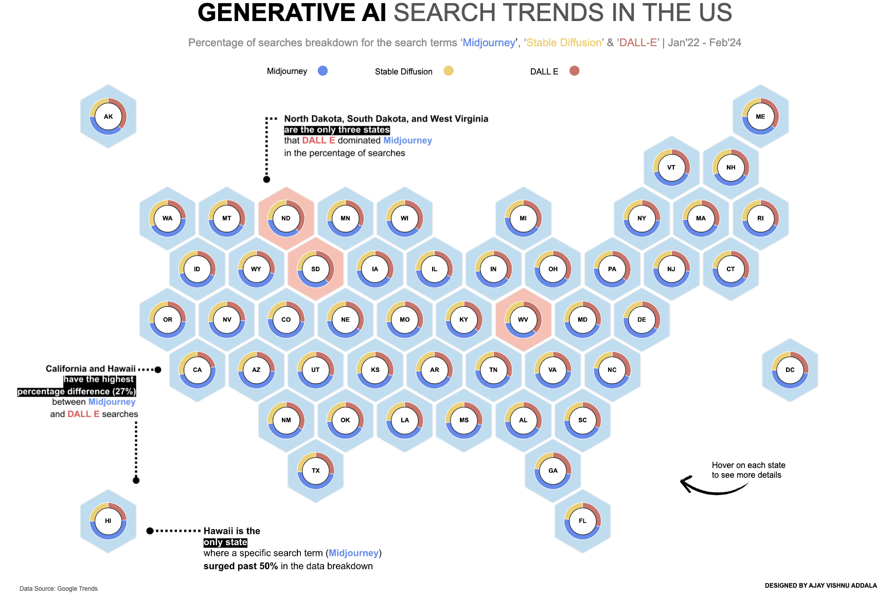

# Generative AI Search Trends Visualization

## Overview

This project visualizes generative AI search trends in the United States using Tableau. The visualization aims to uncover insights into the dominance of different search terms across states, identify states with significant differences in search term percentages, and highlight states with a dominating search term compared to others.

## Features

- **Map Hex Bins**: Each hex bin on the map represents a region, with donut charts displaying the distribution of three search terms: Midjourney, Stable Diffusion, and DALL E.
- **Lollipop Charts**: Lollipop charts appear upon hovering over a state, showing the percentage breakdown of each search term for that state.
- **Annotations**: Key highlights and insights are annotated throughout the visualization, providing context and guiding the interpretation of the data.

## Questions Answered

1. **Dominant Search Term**: Which search term dominates each state?
2. **Percentage Differences**: Which states exhibit the highest percentage differences between search terms?
3. **State Dominance**: Which states have a dominating search term compared to others?

## Data Sources

The data used in this visualization is sourced from Google Trends. The dataset includes the percentage distribution of search terms (Midjourney, Stable Diffusion, and DALL E) for various regions in the United States.

## How to Use

1. **Clone the Repository**: Clone this GitHub repository to your local machine.

2. **Access Data and Tableau File**: The dataset and Tableau workbook are available in the repository. You can download them and explore the visualization using Tableau Desktop or Tableau Public.

3. **Explore and Analyze**: Open the Tableau workbook in Tableau Desktop or upload it to Tableau Public. Please interact with the visualization to explore generative AI search trends across different states and answer the questions I've included.

## Contributing

Contributions are welcome! Feel free to open an issue or pull request in this repository if you have any suggestions, improvements, or additional insights to add to the visualization.
